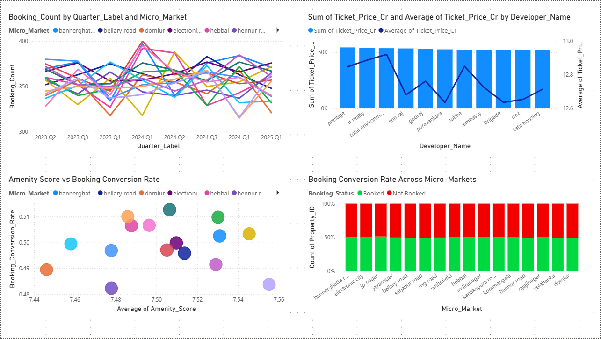
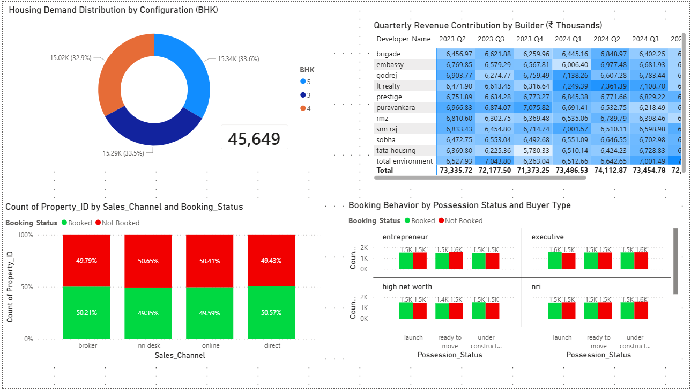
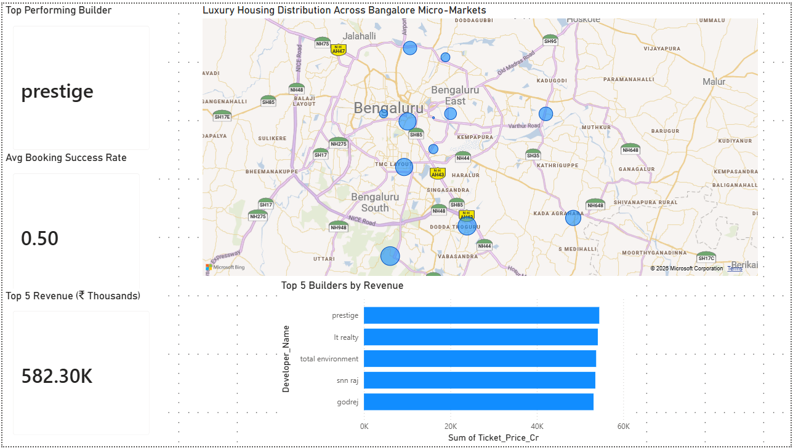
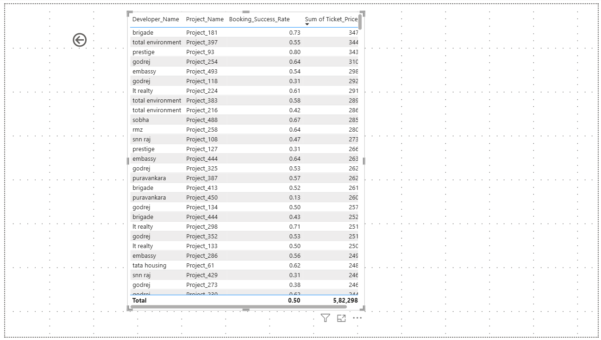

# 🏡 Luxury Housing Analytics — End-to-End Data Project

## 📊 Project Overview

This project analyzes a luxury housing dataset to understand **market trends, builder performance, buyer behavior, and geographic distribution**.

The workflow covers the complete data pipeline:

* Data cleaning & EDA (Python)
* Data storage & querying (SQL)
* Data visualization (Power BI)

---

## 🎯 Objective

To build a structured dashboard that provides insights into:

* Booking trends over time
* Developer performance
* Buyer preferences
* Sales channel effectiveness
* Geographic demand distribution

---

## 🔄 End-to-End Workflow

1. **Data Collection**
   Raw housing dataset

2. **Data Cleaning & EDA (Python)**

   * Handled missing values
   * Analyzed distributions
   * Explored relationships between features

3. **Data Storage (SQL)**

   * Designed table schema
   * Wrote queries for business metrics

4. **Data Visualization (Power BI)**

   * Built interactive dashboard
   * Used DAX for calculations

---

## 📊 Dashboard Features

* Booking trends by quarter and micro-market
* Revenue and ticket price analysis
* Conversion rate analysis
* Demand distribution by BHK
* Sales channel performance
* Geographic insights
* Drill-through for detailed analysis

---

## 🧠 Key Insights

* Market shows **stable booking trends**
* Developers have **similar revenue performance**, indicating competition
* Conversion rates are around **50% across markets**
* Amenities show **low correlation with booking decisions**
* Demand is **evenly distributed across configurations**
* Sales channels perform **similarly across regions**

---

## 📸 Dashboard Preview

### Page 1 — Trends & Performance



### Page 2 — Demand & Behavior



### Page 3 — Geo & KPIs



### Page 4 — Drill-through



---

## 🗄️ SQL Queries

Key queries include:

* Revenue aggregation by developer
* Conversion rate calculation
* Booking trends analysis
* Demand segmentation

Refer: `sql/queries.sql`

---

## ⚙️ Tools & Technologies

* Python (Pandas, NumPy, Matplotlib)
* SQL (MySQL)
* Power BI
* Jupyter Notebook

---

## 📁 Project Structure

```
Luxury-Housing-Analytics/
│
├── dataset/
├── notebooks/
├── sql/
├── powerbi/
├── Images/
├── README.md
└── requirements.txt
```

---

## 🚀 Business Value

This dashboard helps:

* Compare developer performance
* Understand market competition
* Identify demand patterns
* Support pricing and marketing strategies

---

## 🔐 Note

Database credentials are handled securely using environment variables and are not included in this repository.

---
